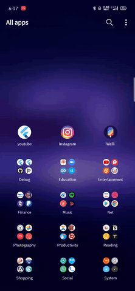

# youtube

Sample app showcasing youtube search functionality

## Demo


## Getting Started

edit lib/src/api.dart and put api key for youtube. 

```dart
...

import 'dart:convert' as convert;

const GOOGLE_APIS = 'www.googleapis.com';
const API_KEY = 'Paste your api key here';

Uri searchUrl(dynamic options) =>
    Uri.https(GOOGLE_APIS, 'youtube/v3/search', options);


...
```

## Library Used

  - [http](https://pub.dev/packages/http)
  - [flutter_bloc](https://pub.dev/packages/flutter_shimmer)
  - [flutter_shimmer](https://pub.dev/packages/flutter_shimmer)
  - [flutter_svg](https://pub.dev/packages/flutter_svg)
  - [connectivity](https://pub.dev/packages/connectivity)

